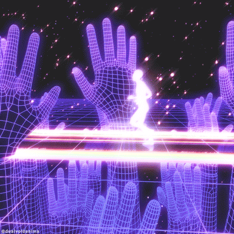

  
 
  

 

### hey, I'm Anushka 💫 — an engineer who builds, and a researcher who keeps asking *why*.

I move between backend systems, LLM applications, and cryptographic research.

 

## what I'm obsessed with

`backend architecture` · `RAG & AI agents` · `multimodal AI` · `chaos-based cryptography` · `the gap between "it works" and "I understand why`· `Universe` · `Consciousness` · `Awareness` · `Nothingness`

 

## Tech stack

 

usually found somewhere between a stack trace and a research paper.

 &nbsp;  &nbsp; 

